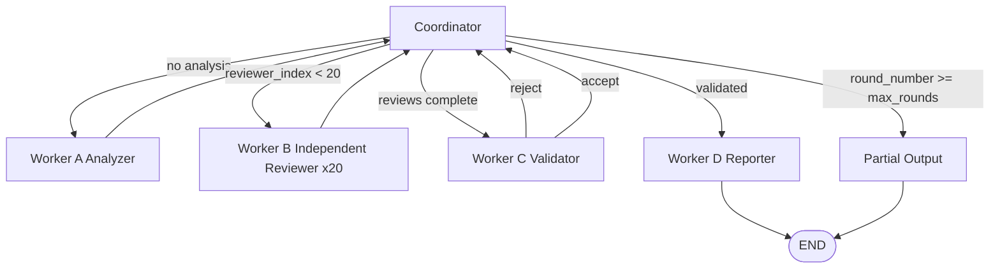

# Design Documentation — Academic Research Orchestrator

## Architecture diagram

## State-routing explanation

Routing decisions are derived only from `AgentState`:

- Missing `analysis_payload` → Analyzer
- `reviewer_index < target_reviewers` → Reviewer (isolated; prior reviews excluded from Worker B context)
- Reviews complete and not validated → Validator
- `is_validated` → Reporter
- `rejection_flag` → increment `round_number`, rollback to Analyzer
- `round_number >= max_rounds` (default 5) → Partial Output termination

This yields conditional transitions, retry loops, and explicit termination without a fixed linear pipeline.

## Contract-first design

`contract.py` freezes:

- `AgentState` — universal graph state
- `AnalysisPayload` / `ReviewSchema` — structured I/O
- `ALLOWED_TOOLS` — capability boundary
- `InvalidToolCallException` — policy violation type
- Constants: `MAX_ROUNDS`, `TOKEN_SOFT_LIMIT`, `SCHEMA_RETRY_LIMIT`

All workers import these schemas; nodes must not invent parallel ad-hoc dictionaries for core fields.

## Six implemented failure modes

| # | Failure | Guardrail | Location |
|---|---------|-----------|----------|
| 1 | Infinite retry loops | `round_number >= 5` → partial | `main_system.coordinator_node`, `student_1_loop` |
| 2 | Silent structural failure | Pydantic + 1 retry | `agents.guardrails.validate_analysis_payload`, `student_2_silent` |
| 3 | Rogue tool calls | Allowlist middleware | `tools.tool_runtime`, `student_3_rogue` |
| 4 | Downstream cascade | Sanitization + rollback | `sanitize_state_invariants`, `student_4_cascade` |
| 5 | Privacy leak in traces | Redaction interceptor | `redact_for_telemetry`, `student_5_trace` |
| 6 | Token / context explosion | Prune + summarize | `manage_context`, `student_6_tokens` |

## Nineteen additional failure risks considered

1. Prompt injection via paper text  
2. Cross-reviewer contamination (information leakage between personas)  
3. Non-termination from LangGraph recursion limits alone  
4. Partial file writes leaving corrupt review artifacts  
5. Clock skew in latency metrics  
6. Schema drift between contract versions  
7. Over-redaction destroying debug utility  
8. Under-redaction of novel secret formats  
9. Tool argument type confusion (string vs path traversal)  
10. Replay attacks on cached tool results  
11. Model refusal loops under Ollama  
12. Duplicate reviewer IDs under concurrent runs  
13. Disk exhaustion from unbounded trace logs  
14. Unicode normalization mismatches in paper IDs  
15. False-positive cascade rejects starving the reporter  
16. Metrics fabrication if tests are skipped  
17. Environment variable leakage into child processes  
18. Dependency supply-chain risk in pip packages  
19. Human operators accepting all cookies on publisher sites  

## Alternative mitigations

| Risk | Alternatives |
|------|----------------|
| Loops | External watchdog process; circuit breaker library |
| Schema | JSON Schema + ajv-style validators; OpenAPI contracts |
| Tools | OS sandbox / seccomp; separate tool microservice |
| Cascade | Saga pattern with compensating transactions |
| Privacy | Dedicated PII vault; field-level encryption |
| Tokens | Sliding window embeddings; remote summarization service |

## Design tradeoffs

- **Deterministic builders vs live LLM**: default offline path maximizes reproducibility and avoids paid APIs; live Ollama improves linguistic variety but reduces determinism.
- **Retry round vs workflow step counting**: `round_number` tracks rejection retries only so twenty reviewer executions remain possible under a retry ceiling of five.
- **Hardcoded allowlist vs dynamic discovery**: prefer explicit safety over flexible plugins for coursework threat model.

## Safety constraints

- Mock all destructive tools  
- Never execute real trades or deletes  
- Never commit `.env` secrets  
- Necessary/Essential cookies only for any browser interaction  
- No assistant-product branding in repository text  
