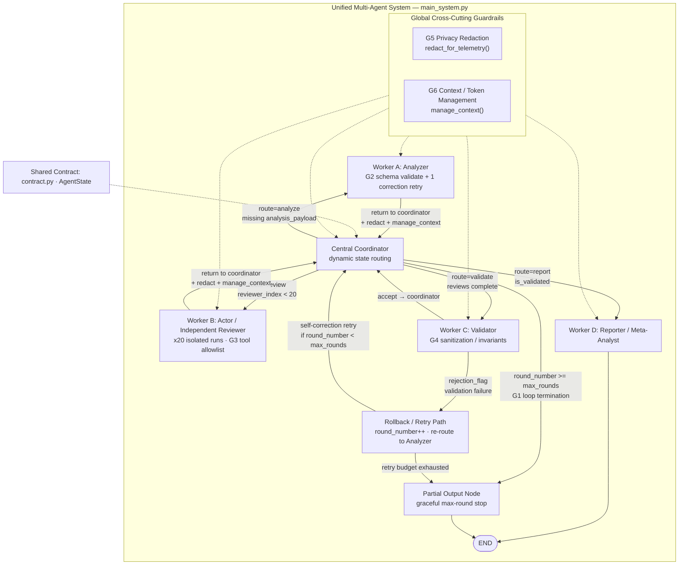

# Academic Research Assistant — Multi-Agent Failure Modes & Guardrails

**Group 7 · Single-author submission · Audrey Rah**

This repository is a complete solo submission. One developer designed the shared contract, implemented all six failure-mode guardrails, integrated them into one multi-agent system, measured before/after metrics, and wrote all interview stories. The folders named `student_1_loop` … `student_6_tokens` follow the assignment’s required directory labels for each failure mode; they are **not** contributions from six different people.

## Project overview

Production-style multi-agent system that analyzes an academic preprint, runs twenty independent reviewer personas as isolated executions of a single Reviewer worker, validates structured outputs, and compiles a meta-analysis report. The graph is coordinator-driven with conditional routing, retry/rollback paths, and explicit termination—not a linear single-agent pipeline.

## Chosen domain

**Academic Research Assistant**

Workflow: Literature load → Paper analysis → Independent review (×20) → Validation → Meta-analysis report

Target paper: Research Square preprint `rs-10485157` / DOI `10.21203/rs.3.rs-10485157/v1`  
Local extract: `data/paper_extract.txt`

## Architecture

One unified coordinator-driven system (not six separate projects). Failure-mode packages `student_1_*` … `student_6_*` document each guardrail; all six are wired into `main_system.py`.



Rendered image: [`architecture_diagram.png`](architecture_diagram.png)

| Guardrail | Where it sits in the unified graph |
|-----------|--------------------------------------|
| G1 Infinite-loop stop | Coordinator → Partial Output when `round_number >= max_rounds` |
| G2 Silent/structural | Worker A schema validation + one correction retry |
| G3 Rogue tools | Worker B allowlist middleware |
| G4 Cascade | Worker C sanitization; rejection → rollback |
| G5 Privacy | Global redaction on telemetry events |
| G6 Tokens | Global `manage_context` on message history |

```
Coordinator
  ├─ Worker A: Analyzer
  ├─ Worker B: Actor / Independent Reviewer  (repeated 20×, isolated state)
  ├─ Worker C: Validator
  └─ Worker D: Reporter / Meta-Analyst
```

Shared contract: `contract.py` (`AgentState`, `AnalysisPayload`, `ReviewSchema`).  
All six guardrails are active inside `main_system.py` (via `agents/guardrails.py` and `tools/tool_runtime.py`).

## Installation

```bash
python -m venv .venv
# Windows
.venv\Scripts\activate
pip install -r requirements.txt
```

## Local model setup (optional)

1. Install [Ollama](https://ollama.com) locally.
2. Pull a small free model, e.g. `ollama pull llama3.2`.
3. Copy `.env.example` to `.env` and set `USE_MOCK_LLM=false`, `OLLAMA_MODEL=llama3.2`.

The default configuration uses deterministic structured builders so the full graph and tests run without any paid API and without requiring Ollama.

## Environment configuration

```bash
copy .env.example .env
```

| Variable | Purpose |
|----------|---------|
| `USE_MOCK_LLM` | `true` = offline deterministic path (default) |
| `OLLAMA_BASE_URL` | Local Ollama endpoint |
| `LANGCHAIN_TRACING_V2` | Keep `false` unless using free-tier tracing |
| `LANGCHAIN_API_KEY` | Optional free-tier key; never commit real keys |

## Execution

```bash
python main_system.py
```

Produces:

- `outputs/reviews/reviewer_01.md` … `reviewer_20.md`
- `outputs/meta_analysis.md`
- `outputs/final_report.md`
- `traces/redacted_events.log`

## Testing

```bash
pytest -q
```

Each `student_*/test_failure.py` is a failure-mode package authored by the same developer. It reproduces that mode with the guardrail disabled (safely mocked) and writes measured `metrics.md`.

## Output locations

| Path | Content |
|------|---------|
| `outputs/reviews/` | Twenty independent reviews |
| `outputs/meta_analysis.md` | Aggregate recommendation tally |
| `outputs/final_report.md` | End-to-end run report |
| `traces/` | Redacted telemetry events |

## Guardrail summary (all implemented by one author)

1. **Loop** (`student_1_loop`) — `round_number >= 5` → partial output  
2. **Silent structure** (`student_2_silent`) — Pydantic schema + one correction retry  
3. **Rogue tools** (`student_3_rogue`) — hardcoded allowlist + `InvalidToolCallException`  
4. **Cascade** (`student_4_cascade`) — sanitization node + rejection/rollback  
5. **Privacy** (`student_5_trace`) — centralized redaction before traces  
6. **Tokens** (`student_6_tokens`) — context prune/summarize under soft limit  

## Repository structure

```
contract.py
main_system.py
agents/          helpers + guardrails
tools/           mocked tool runtime
prompts/
data/
outputs/
traces/
tests/
student_1_loop/ … student_6_tokens/   # required failure-mode package names
```

## Safety statement

All destructive or external side effects are mocked. Unauthorized tools never execute real deletes, trades, or infrastructure changes. Secrets belong only in local `.env` (gitignored). Cookie policy for live browsing demos: Necessary/Essential cookies only—never Accept All.

## Limitations

- Demo video recording(s) for the six failure modes and the integrated system must be filmed manually by the author.
- Live Ollama quality depends on the local model; default path uses deterministic builders.
- LangSmith tracing is optional and disabled by default.
- Paper text is loaded from a local extract to avoid repeated remote downloads.
